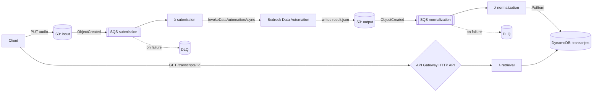

# Voice Insights on Bedrock

[](./LICENSE)
[](https://nodejs.org/)
[](https://www.typescriptlang.org/)
[](https://www.terraform.io/)
[](https://aws.amazon.com/bedrock/)

A production-shaped, serverless audio understanding pipeline. Drop an audio file into S3 and an HTTP API returns a structured transcript with topics, sentiment, segment-level diarization, and action items — extracted by **Amazon Bedrock Data Automation** behind three single-purpose Lambdas.

> Portfolio project. Clean-room implementation, MIT-licensed, public domain test audio. See [WHY.md](./WHY.md) for the design rationale.

---

## Table of contents

- [Architecture](#architecture)
- [Tech stack](#tech-stack)
- [Quickstart](#quickstart)
- [API reference](#api-reference)
- [Testing](#testing)
  - [Unit tests (Vitest)](#unit-tests-vitest)
  - [API smoke tests (Postman / Newman)](#api-smoke-tests-postman--newman)
- [Repository layout](#repository-layout)
- [Configuration](#configuration)
- [Operational notes](#operational-notes)
- [Roadmap](#roadmap)
- [License](#license)

---

## Architecture



Three responsibilities, three Lambdas, three IAM roles. Every queue has a dead-letter queue. The whole thing is provisioned by Terraform — no console clicks required after the initial Bedrock Data Automation project is created.

## Tech stack

| Layer | Choice |
|------|--------|
| Language / runtime | TypeScript 5.6 (strict), Node 20 |
| Compute | AWS Lambda (esbuild-bundled, externalizing `@aws-sdk/*`) |
| AI / extraction | Amazon Bedrock Data Automation |
| Storage | S3 (input + output), DynamoDB (on-demand) |
| Eventing | S3 → SQS (with DLQs) → Lambda, partial-batch-failure aware |
| API | API Gateway HTTP API v2 |
| Validation | Zod 4 schemas, `@aws-lambda-powertools/parser` |
| IaC | Terraform |
| Tests | Vitest + `aws-sdk-client-mock` (unit), Newman (API) |
| Tooling | Yarn workspaces, esbuild |

## Quickstart

**Prerequisites:** Node 20+, Yarn 1.22, Terraform 1.5+, an AWS account with Bedrock Data Automation enabled in `us-east-1`, and AWS CLI credentials.

```bash
# 1. Install + verify
yarn install
yarn typecheck
yarn test

# 2. Bundle Lambdas into terraform/dist/
yarn build

# 3. Create the Bedrock Data Automation project (one-time)
./scripts/create-bda-project.sh    # prints the project ARN
```

```bash
# 4. Configure Terraform
cd terraform
cp terraform.tfvars.example terraform.tfvars
#   paste the BDA project ARN + profile ARN into terraform.tfvars

terraform init
terraform apply
```

```bash
# 5. End-to-end test
INPUT=$(terraform -chdir=terraform output -raw input_bucket)
API=$(terraform -chdir=terraform output -raw api_endpoint)

aws s3 cp ./samples/hello.wav s3://$INPUT/samples/hello.wav
# wait ~30–60s for Bedrock Data Automation to finish

# find the jobId in the submission Lambda's logs
aws logs tail /aws/lambda/voice-insights-dev-submission --since 5m

curl "$API/transcripts/<jobId>"
```

Tear it all down with `terraform destroy` (or `./scripts/destroy-cli.ps1` on Windows).

## API reference

The retrieval API is unauthenticated by design for the portfolio demo — see [Roadmap](#roadmap) for the auth plan.

### `GET /transcripts/{jobId}`

**Path parameters**

| Name | Type | Constraints |
|------|------|-------------|
| `jobId` | string | 1–200 chars |

**Responses**

<details>
<summary><code>200 OK</code> — transcript found</summary>

```json
{
  "jobId": "samples-hello-20260524-202205-wav-07a2824a-66c0-45f6-ba02-8099b983609e",
  "s3Key": "transcripts/.../result.json",
  "language": "en",
  "durationMs": 14961,
  "transcript": "Hello, this is a test recording for the Voice Insights pipeline. ...",
  "segments": [
    { "speaker": "spk_0", "startMs": 120,  "endMs": 3950,  "text": "Hello, this is a test recording for the Voice Insights pipeline." },
    { "speaker": "spk_0", "startMs": 4780, "endMs": 10480, "text": "The customer reports a billing issue on their auto policy and would like a call back within 24 hours." }
  ],
  "topics": ["billing issue", "auto policy", "callback request"],
  "sentiment": "neutral",
  "actionItems": ["Call the customer back within 24 hours to resolve the billing issue."],
  "createdAt": "2026-05-25T00:29:02.250Z"
}
```
</details>

<details>
<summary><code>400 Bad Request</code> — invalid path parameter</summary>

```json
{
  "error": "bad_request",
  "message": "Invalid path parameters",
  "details": [
    { "origin": "string", "code": "too_small", "minimum": 1, "path": ["jobId"], "message": "Too small: expected string to have >=1 characters" }
  ]
}
```
</details>

<details>
<summary><code>404 Not Found</code> — no transcript for that <code>jobId</code></summary>

```json
{ "error": "not_found", "message": "No transcript for jobId=<jobId>" }
```
</details>

<details>
<summary><code>500 Internal Server Error</code> — DynamoDB failure</summary>

```json
{ "error": "internal_error", "message": "Failed to fetch transcript" }
```
</details>

## Testing

### Unit tests (Vitest)

Every handler is covered: validation paths, success paths, and DLQ-eligible failure paths. AWS SDK calls are mocked with `aws-sdk-client-mock`, so the suite runs offline in under a second.

```bash
yarn test            # one-shot
yarn test:watch      # TDD loop
yarn typecheck       # tsc -b across the workspaces
```

### API smoke tests (Postman / Newman)

A Postman v2.1 collection lives in [`postman/`](./postman/) with environment-driven variables. The same file runs interactively in Postman and headlessly in CI via Newman.

```bash
yarn test:api
```

Sample run against the dev deploy:

```
→ Get transcript by jobId
  GET .../transcripts/samples-...  [200 OK, 1.79kB, 471ms]
  ✓  Status is 200
  ✓  Body has the canonical fields
  ✓  jobId in response matches request
  ✓  segments contain timestamp ordering

→ Get transcript (unknown jobId — expect 404)               ✓  Status is 404 (or 4xx)
→ Get transcript (empty jobId — expect 400)                 ✓  Status is 400
                                                            ✓  Error envelope is bad_request
→ Get transcript (unsupported method — expect 405)          ✓  Status is 4xx

assertions: 8 executed, 0 failed
```

See [`postman/README.md`](./postman/README.md) for how to point the collection at a different deploy, seed a fresh `jobId`, and what each scenario verifies.

## Repository layout

```
voice-insights-bedrock/
├── src/
│   ├── shared/                  # Zod schemas, logger factory, validateEvent helper
│   └── handlers/
│       ├── submission/          # S3 → SQS → InvokeDataAutomationAsync
│       ├── normalization/       # S3 → SQS → reads BDA result, writes DynamoDB
│       └── retrieval/           # API Gateway HTTP API → GetItem from DynamoDB
├── terraform/                   # Full IaC: S3, SQS, DynamoDB, Lambdas, API, IAM, logs
├── postman/                     # Newman-runnable collection + env file
├── events/                      # Sample Lambda invocation payloads (CLI / console)
├── scripts/
│   ├── build-lambda.mjs         # esbuild bundler
│   ├── create-bda-project.sh    # one-time BDA project creation
│   ├── deploy-cli.ps1           # Windows convenience wrapper
│   └── destroy-cli.ps1
├── WHY.md                       # design rationale + tradeoffs
└── README.md
```

## Configuration

All Terraform inputs live in [`terraform/variables.tf`](./terraform/variables.tf). The values you typically need to set:

| Variable | Default | Notes |
|----------|---------|-------|
| `aws_region` | `us-east-1` | Bedrock Data Automation availability dictates the region. |
| `project_name` | `voice-insights` | Prefix used in every resource name. |
| `environment` | `dev` | Used in resource names and the `Environment` tag. |
| `bda_project_arn` | _(required)_ | Output of `./scripts/create-bda-project.sh`. |
| `bda_profile_arn` | _(required)_ | e.g. `arn:aws:bedrock:us-east-1:<account>:data-automation-profile/us.data-automation-v1` |
| `lambda_memory_mb` | `512` | Submission/retrieval are tiny; normalization benefits from headroom. |
| `lambda_timeout_seconds` | `60` | BDA submission is async, so 60s is generous. |
| `log_retention_days` | `14` | CloudWatch Logs retention. |

Lambda runtime config (`TRANSCRIPTS_TABLE`, `BDA_PROJECT_ARN`, `OUTPUT_BUCKET`, …) is wired by Terraform — handlers read it via a Zod-validated `getEnv()` helper that fails fast on misconfiguration.

## Operational notes

- **Cold start.** Bundled handlers are 200–500 KB; cold start sits around 300–500 ms on Node 20.
- **Failure handling.** SQS partial-batch-failure responses surface only the truly-failed messages to the DLQ — successful records in the same batch are not retried.
- **Idempotency.** The normalization Lambda uses `PutItem` with the BDA `jobId` as the partition key. Re-delivery is effectively idempotent.
- **Cost shape.** Idle cost is effectively zero: pay-per-request DynamoDB, on-demand Lambda, HTTP API at $1/million requests, BDA priced per page/second of input.
- **Observability.** Powertools `Logger` emits structured JSON to CloudWatch Logs with `serviceName`, `jobId`, and correlation fields. Drop into Logs Insights to slice by handler.

## Roadmap

- **v0.2** — Cognito-secured retrieval API, EventBridge `transcript.ready` notification, simple React upload page on CloudFront.
- **v0.3** — Multi-language detection, structured search (by topic / sentiment) backed by OpenSearch Serverless.
- **v0.4** — Streaming partial transcripts via WebSocket API for long-form audio.

## License

MIT — see [LICENSE](./LICENSE). Built by [Aravind Domakonda](https://github.com/Domakonda).
